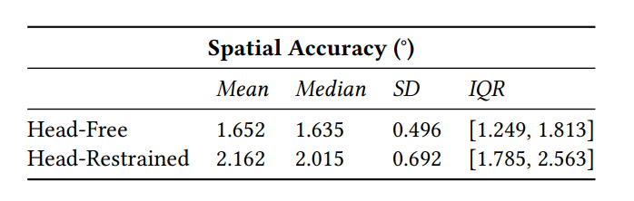
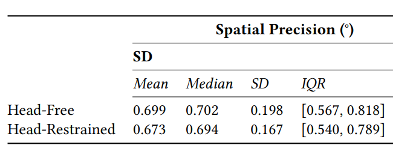

tracking accuracy and precision of quest pro

1. **A Preliminary Study of the Eye Tracker in the Meta Quest Pro**
    - [link](https://dl.acm.org/doi/pdf/10.1145/3573381.3596467)，探究了0-15度范围，也就是30度FOV的精度和准确度，精度指的是偏离目标角度平均值，准确度指的是抖动值
    - accuracy:
    - precision:
    - 给小目标的gaze / dwell提供了一些设计的参考