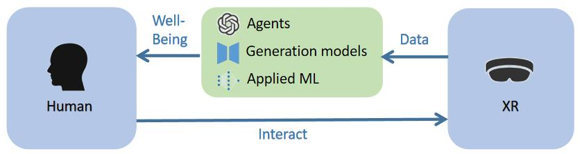
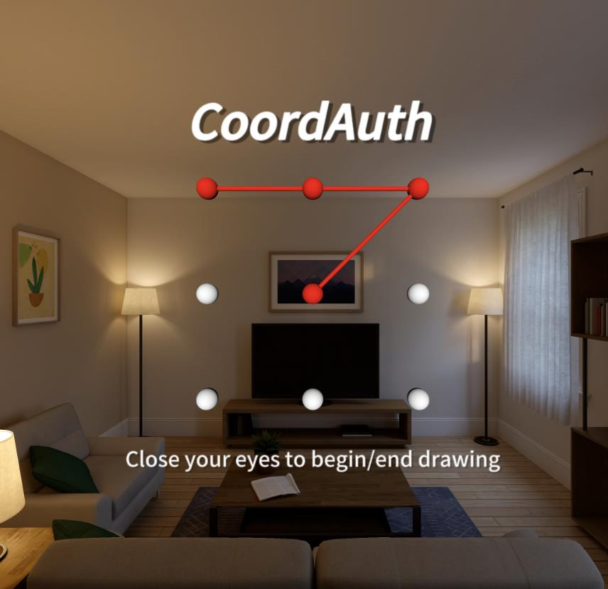

<!-- # Hey there, I'm Alexzhao (Sheng Zhao)!  -->

## Who I am

I'm **Sheng Zhao** (赵晟), and you can call me Alex. I'm a junior at [**Tsinghua University**](https://www.tsinghua.edu.cn/en/), Beijing, China 🏫. Now I am pursuing a dual degree in **Fundamental Science** (Physics) and **Electrical Engineering**🎓 .

## Education

  

  
  

      <b><a href="https://www.tsinghua.edu.cn/en/">Tsinghua University</a></b>
        2021.9 - Present
        <b>B.Eng. in Electrical Engineering</b>
        <b>B.S. in Fundamental Sciences</b> (Physics)
      <!--   Research Assistant at HCI-Group, advised by Prof. <i>Xin Yi</i>
        Research Intern at C3ILab, advised by Prof. <i>Bowen Zhou</i> -->

  

## Research Experience

Formerly, I was a research assistant at **Tsinghua University HCI Group**, under the advisory of Assistant Professor [<i>Xin Yi</i>](https://scholar.google.com/citations?hl=en&user=7Uy9RVYAAAAJ) and Professor [<i>Yuanchun Shi</i>](https://scholar.google.com/citations?user=TZm3-pwAAAAJ&hl=en&oi=ao). Meanwhile, I was a research intern under the supervisor of Chair Professor [<i>Bowen Zhou</i>](https://scholar.google.com/citations?user=h3Nsz6YAAAAJ) at **Tsinghua University**. And I also collaborated with Assistant Professor [<i>Yukang Yan</i>](https://scholar.google.com/citations?user=AXGtrecAAAAJ&hl=en&oi=ao) at **University of Rochester** remotely. Currently, I'm a research intern at **School of Information, University of Michigan**, under the supervisor of Associate Professor [<i>Michael Nebeling</i>]() and Postdoc [<i>Janet Johnson</i>]().<!--I am also delighted to collaborate and discuss with my classmates [<i>Junrui Zhu</i>](https://zhujuneray.github.io/) and [<i>Jingwei Zuo</i>](https://dr-left.github.io/).-->
<!-- And at the same time, I'm a visiting student at [C3ILab](http://c3i.ee.tsinghua.edu.cn/), Tsinghua University, under the advisory of Prof. [Bowen Zhou](https://scholar.google.com/citations?user=h3Nsz6YAAAAJ&hl=en&oi=ao). -->

I conduct research in Technical Human-Computer Interaction (Tech HCI) domain, as well as the Multi Model Representation Learning domain. In detail:

- Building the trustworthy and efficient interaction system between human and XR, fully considering usable privacy, social presence, by applied machine learning, qualititive and quantitive research methods.

- Exploring the design space of human LLMs interaction in 3D environments (e.g., virtual reality, augmented reality) to enhance LLMs' ability to serve humans (improve efficiency in collaboration; enhance well-being), as well as the generative capabilities of GAI (i.e. latent diffusion models) in 3D reconstruction space to enable more efficient and controllable human utilization.

<!-- 

  

 -->

## Publications & Manuscripts

<!-- I am striving to submit my work to <i>IMWUT (Ubicomp), UIST, CHI, MM</i> and <i>TVCG</i>.  -->

<!-- 

  
Click to view <b>publications & manuscripts</b>:
 -->

  <!-- 

    
 -->

  

  
  

      <b><a href="https://zhaosheng-thu.github.io/publications/CoordAuth">CoordAuth: A Two-factor Authentication Method in Virtual Reality Leveraging Head-Eye Coordination</a></b>
        <b>Anonymous author(s)</b>, 1st Author.
      <!--   <i>The 2024 ACM international joint conference on Pervasive and Ubiquitous Computing & The 2024 ACM International Symposium on Wearable Computing (Ubicomp / ISWC 2024)</i>, under review. -->
       Preprint, [<a href="https://zhaosheng-thu.github.io/publications/imwut24a-sub3876.pdf">PDF</a>]
      <!--  (Rejected by <i>IMWUT'24-a</i>) -->
      <!--  [<a href="https://zhaosheng-thu.github.io/publications/imwut24a-sub3876.pdf">Paper</a>]
      [<a href="https://github.com/zhaosheng-thu/VRAuthentication">Code</a>]  -->

  

  
  

      <b><a href="https://zhaosheng-thu.github.io">Raise Your Eyebrows: Investigating the Impact of Virtual Avatar’s Facial Expression Scaling on Users’ Perception of Emotion and Uncanny Valley Effect in Social Virtual Reality</a></b>
        <b>Anonymous author(s)</b>, Co-1st Author.
       Preprint, [<a href="https://zhaosheng-thu.github.io/">PDF</a>]
      <!--   <i>IEEE Transactions on Visualization and Computer Graphics (TVCG)</i>, under review. -->
      <!--   [<a href="https://github.com/zhaosheng-thu/AvatarFacial">Code</a>] -->
  

## Hobbies

- 🎵 Favorite musicians: Stefanie Sun(孙燕姿) and Jay Chou(周杰伦).
- 📚 Favorite book: Dream of the Red Chamber(红楼梦).
- 🚴‍♂️ Passionate about outdoor activities and proud member of the **Tsinghua Cycling Team**. Strava account [here](https://www.strava.com/athletes/107292471). 
<!-- - :soccer: A soccer enthusiast, a dedicated supporter of Cristiano Ronaldo. -->

<!-- ## Others

I'll apply for HCI Ph.D. starting at Fall 2025.  -->