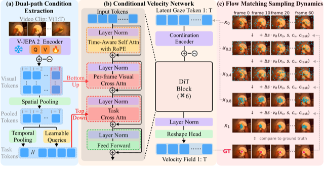
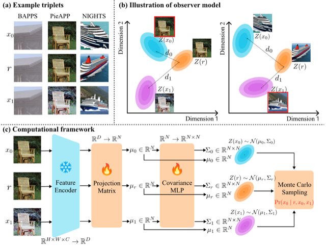
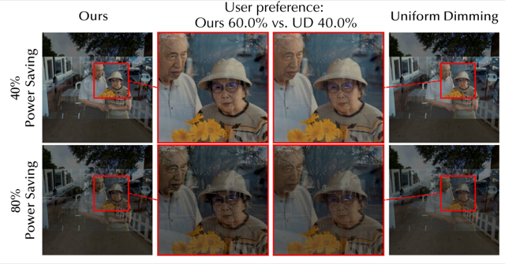
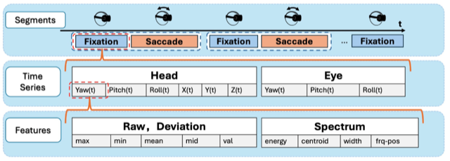
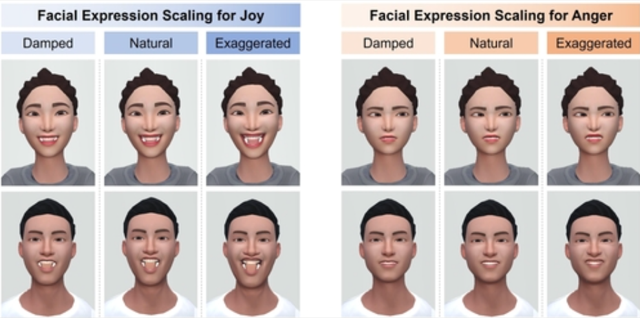
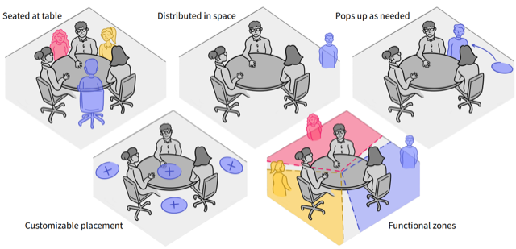

## Who I am

I am Sheng Zhao (赵晟), a 1st-year Ph.D. student in Computer Science at the University of Rochester, NY, USA, advised by Prof. [Yuhao Zhu](https://yuhaozhu.com/). My research interests lie in **visual computing** and **deep learning**.

<!-- Previously, I interned on the AI Coding Team at ByteDance (字节跳动) and worked as a research intern at Z.ai (智谱). I received my Bachelor’s degree from Tsinghua University, Beijing, China. -->

  <a href="mailto:alexzhao0705@gmail.com">Email</a> &nbsp;/&nbsp;
  <a href="https://scholar.google.com/citations?user=sxEizdsAAAAJ">Google Scholar</a> &nbsp;/&nbsp;
  <a href="https://www.linkedin.com/in/sheng-zhao-027719290/">LinkedIn</a> &nbsp;/&nbsp;
  <a href="https://github.com/zhaosheng-thu">GitHub</a>

  <b style="color: #c0392b;">I am looking for a research internship in the U.S. for Summer 2027.</b> If you think I could be a good fit, please feel free to reach out via <a href="mailto:alexzhao0705@gmail.com" style="color: #c0392b; text-decoration: underline;">email</a>.

## Latest News

<!-- News box: scrolls vertically once the list exceeds max-height -->

  

    
    
Sep 24, 2026

    
Two papers are accepted to <b>NeurIPS 2026</b> main track, see you in Atlanta!

  

  

    
    
Jul 13, 2026

    
One paper is accepted to <b>TVCG 2026</b> (ISMAR journal track).

  

  

    
    
Jan 20, 2026

    
Started my Ph.D. study in Computer Science at the <a href="https://www.rochester.edu/">University of Rochester</a>, as a first-year student.

  

## Educational Background

  
  

      <b><a href="https://www.rochester.edu/">University of Rochester</a></b>
      <!--   2026.1 -  -->
        <i style="color: #888;">Spring 2026 - Present</i>
        <b>1st-year Ph.D. student in Computer Science</b>
        Advisor: Professor <a href="https://yuhaozhu.com/"><i>Yuhao Zhu</i></a>
  

  

  
  

      <b><a href="https://www.tsinghua.edu.cn/en/">Tsinghua University</a></b>
        <i style="color: #888;">Sep 2021 - Jun 2025</i>
        <b>B.S. in Mathematics and Physics</b> 
        <b>B.Eng. in Electrical Engineering</b>

  

Additionally, I have conducted research as a Research Assistant at the University of Michigan, Ann Arbor, under the supervision of Professor <a href="https://si.umich.edu/people/michael-nebeling"><i>Michael Nebeling</i></a>; at the Department of Computer Science, University of Rochester, under the supervision of Professor <a href="https://scholar.google.com/citations?user=AXGtrecAAAAJ&hl=en&oi=ao"><i>Yukang Yan</i></a>; and at Tsinghua University, under the supervision of Professor <a href="https://scholar.google.com/citations?user=h3Nsz6YAAAAJ"><i>Bowen Zhou</i></a> and Professor <a href="https://scholar.google.com/citations?hl=en&user=7Uy9RVYAAAAJ"><i>Xin Yi</i></a>.

## Industrial Experience

  
  

      <b><a href="">ByteDance (字节跳动)</a></b>
        <i style="color: #888;">Oct 2025 - Jan 2026</i>
        Intern improving the front-end coding capabilities of agentic model (Seed-1.6-Code, etc.) via SFT and RL.
      <!-- Intern in <a href="https://www.capcut.com/">CapCut</a>,  -->

  

  
  

      <b><a href="">Z.ai (智谱 AI)</a></b>
        <i style="color: #888;">Mar 2025 - Jul 2025</i>
      <!--   Trajectory synthesis and rejection sampling for <a href="https://docs.z.ai/guides/vlm/glm-4.5v">GLM-4.5v</a>'s SFT and RL post-training on web tool use. -->
        Intern improving <a href="https://docs.z.ai/guides/vlm/glm-4.5v">GLM-4.5v</a>'s GUI web-agent capabilities via SFT and RL.
      <!-- Intern in <a href="https://github.com/THUDM/CogAgent">CogAgent</a>, -->

  

<!-- Additionally, I have conducted research at the Department of **[Computer Science](https://www.rochester.edu/)** of the University of Rochester, working with Professor **[Yukang Yan](https://scholar.google.com/citations?user=AXGtrecAAAAJ&hl=en&oi=ao)**, as well as at the Department of Computer Science and Department of Electronic Engineering of Tsinghua University, under the guidance of Professor **[Xin Yi](https://scholar.google.com/citations?hl=en&user=7Uy9RVYAAAAJ)** and Professor **[Bowen Zhou](https://scholar.google.com/citations?user=h3Nsz6YAAAAJ)**, respectively.
In addition, I served as a research intern in **[PI Lab](https://pi.cs.tsinghua.edu.cn/)**, where I conducted research on persona-aware LLM in the dental domain. -->
<!-- **[PI Lab](https://pi.cs.tsinghua.edu.cn/)** and **[C3I Lab](https://c3i.ee.tsinghua.edu.cn/)**  -->

## Publications

  * Indicates equal contributions, some papers are highlighted. See <a href="https://scholar.google.com/citations?user=sxEizdsAAAAJ">Google Scholar</a> for full list.

2026

  
NeurIPS

  

    
<a href="../files/Egocentric_Gaze_Prediction.pdf" style="color: #1a4b8c;">GazeFlow: From Human Gaze Behavior to Generative Egocentric Gaze Prediction</a>

    
<strong>Sheng Zhao</strong>, Weikai Lin, Yuhao Zhu

    
In 40th Conference on Neural Information Processing Systems (NeurIPS&rsquo;26) &middot; Main Track

    

      <a href="../files/Egocentric_Gaze_Prediction.pdf" style="display: inline-block; padding: 0 8px; border: 1px solid #1a4b8c; border-radius: 3px; margin-right: 6px; text-decoration: none;">PDF</a>
    

  

  
NeurIPS

  

    
<a href="../files/Human_Perceptual_Dimension.pdf" style="color: #1a4b8c;">Multidimensional Observer Model and Perceptual Dimensions of Human Image Quality Assessment</a>

    
<strong>Sheng Zhao</strong>, Weikai Lin, Yuhao Zhu

    
In 40th Conference on Neural Information Processing Systems (NeurIPS&rsquo;26) &middot; Main Track

    

      <a href="../files/Human_Perceptual_Dimension.pdf" style="display: inline-block; padding: 0 8px; border: 1px solid #1a4b8c; border-radius: 3px; margin-right: 6px; text-decoration: none;">PDF</a>
    

  

  
TVCG

  

    
<a href="https://arxiv.org/abs/2607.19509" style="color: #1a4b8c;">LowPowAR: Power-Constrained Tone Mapping for Augmented Reality</a>

    
Weikai Lin, <strong>Sheng Zhao</strong>, Ian Ross, Carl Marshall, Sushant Kondguli, Yuhao Zhu

    
In IEEE Transactions on Visualization and Computer Graphics (TVCG&rsquo;26) &middot; ISMAR Journal Track

    

      <a href="https://arxiv.org/pdf/2607.19509" style="display: inline-block; padding: 0 8px; border: 1px solid #1a4b8c; border-radius: 3px; margin-right: 6px; text-decoration: none;">PDF</a>
      <a href="https://horizon-lab.org/lowpowar/" style="display: inline-block; padding: 0 8px; border: 1px solid #1a4b8c; border-radius: 3px; margin-right: 6px; text-decoration: none;">Webpage</a>
      <a href="https://github.com/horizon-research/LowPowAR" style="display: inline-block; padding: 0 8px; border: 1px solid #1a4b8c; border-radius: 3px; margin-right: 6px; text-decoration: none;">Code</a>
    

  

2025

  
IEEE VR

  

    
<a href="https://ieeexplore.ieee.org/abstract/document/10937423/" style="color: #1a4b8c;">CoordAuth: Hands-Free Two-Factor Authentication in Virtual Reality Leveraging Head-Eye Coordination</a>

    
<strong>Sheng Zhao</strong>*, Junrui Zhu*, Shuning Zhang, Xueyang Wang, Hongyi Li, Fang Yi, Xin Yi, Hewu Li

    
In 32nd IEEE Conference on Virtual Reality and 3D User Interfaces (VR&rsquo;25) &middot; Conference Track

    

      <a href="https://ieeexplore.ieee.org/abstract/document/10937423/" style="display: inline-block; padding: 0 8px; border: 1px solid #1a4b8c; border-radius: 3px; margin-right: 6px; text-decoration: none;">Paper</a>
      <a href="https://ieeevr.org/2025/program/papers/#16" style="display: inline-block; padding: 0 8px; border: 1px solid #1a4b8c; border-radius: 3px; margin-right: 6px; text-decoration: none;">Program</a>
      <a href="https://github.com/zhaosheng-thu/VRAuthentication" style="display: inline-block; padding: 0 8px; border: 1px solid #1a4b8c; border-radius: 3px; margin-right: 6px; text-decoration: none;">Code</a>
    

  

  
CHI

  

    
<a href="https://dl.acm.org/doi/10.1145/3706598.3713688" style="color: #1a4b8c;">Raise Your Eyebrows Higher: Facilitating Emotional Communication in Social Virtual Reality Through Region-specific Facial Expression Scaling</a>

    
Xueyang Wang, <strong>Sheng Zhao</strong>, Yihe Wang, Ziyu Han, Xinge Liu, Xin Tong, Xin Yi

    
In ACM CHI Conference on Human Factors in Computing Systems (CHI&rsquo;25)

    

      <a href="https://dl.acm.org/doi/10.1145/3706598.3713688" style="display: inline-block; padding: 0 8px; border: 1px solid #1a4b8c; border-radius: 3px; margin-right: 6px; text-decoration: none;">Paper</a>
      <a href="https://programs.sigchi.org/chi/2025/program/content/188476" style="display: inline-block; padding: 0 8px; border: 1px solid #1a4b8c; border-radius: 3px; margin-right: 6px; text-decoration: none;">Program</a>
      <a href="https://github.com/zhaosheng-thu/AvatarFacial" style="display: inline-block; padding: 0 8px; border: 1px solid #1a4b8c; border-radius: 3px; margin-right: 6px; text-decoration: none;">Code</a>
    

  

  
CSCW

  

    
<a href="https://arxiv.org/abs/2504.14779" style="color: #1a4b8c;">Exploring Collaborative GenAI Agents in Synchronous Group Settings: Eliciting Team Perceptions and Design Considerations for the Future of Work</a>

    
Janet Johnson, Macarena Peralta, Mansanjam Kaur, Sophia Huang, <strong>Sheng Zhao</strong>, Hannah Guan, Shwetha Rajaram, Michael Nebeling

    
In 28th ACM SIGCHI Conference on Computer-Supported Cooperative Work &amp; Social Computing (CSCW&rsquo;25)

    

      <a href="https://arxiv.org/abs/2504.14779" style="display: inline-block; padding: 0 8px; border: 1px solid #1a4b8c; border-radius: 3px; margin-right: 6px; text-decoration: none;">arXiv</a>
      <a href="https://dl.acm.org/doi/pdf/10.1145/3757595" style="display: inline-block; padding: 0 8px; border: 1px solid #1a4b8c; border-radius: 3px; margin-right: 6px; text-decoration: none;">Paper</a>
    

  

<!-- 

  

    <strong>Sheng Zhao</strong>, Janet Johnson, Xin Yi, and Yukang Yan. <em>Open Your Heart: Investigating the Impact of Dynamic Conversational Strategies and the Multiple Virtual Agent Setting on Emotional Support.</em> 
    <u>In submission</u>. <em></em>
  

 -->

## Service

**Reviewer**: IMWUT 2024; ICWSM 2025; DIS 2025; ISMAR 2025; VR 2025, 2026; CHI 2025, 2026
 **Student Volunteer**: CHI 2025

<!-- ## Repository

  
  

      <b>Single Image Guided Novel View Image Synthesis by SV3D.</b>
       Facilitating more controllable and flexible novel view generation from a single image through precise camera parameters and enhanced attention blocks. 
       [<a href="https://github.com/zhaosheng-thu/NovelView-SVD-finetune">Github</a>]
  

 -->

## Hobbies
- 🎵 Favorite musicians: Stefanie Sun (孙燕姿) and Jay Chou (周杰伦).
- 📚 Favorite book: Dream of the Red Chamber (红楼梦).
- 🚴‍♂️ Passionate about outdoor activities and a proud member of the Tsinghua Cycling Team. Strava account [here](https://www.strava.com/athletes/107292471).

