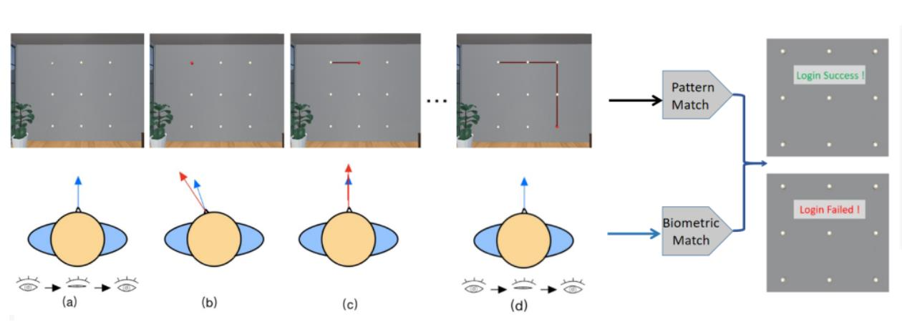
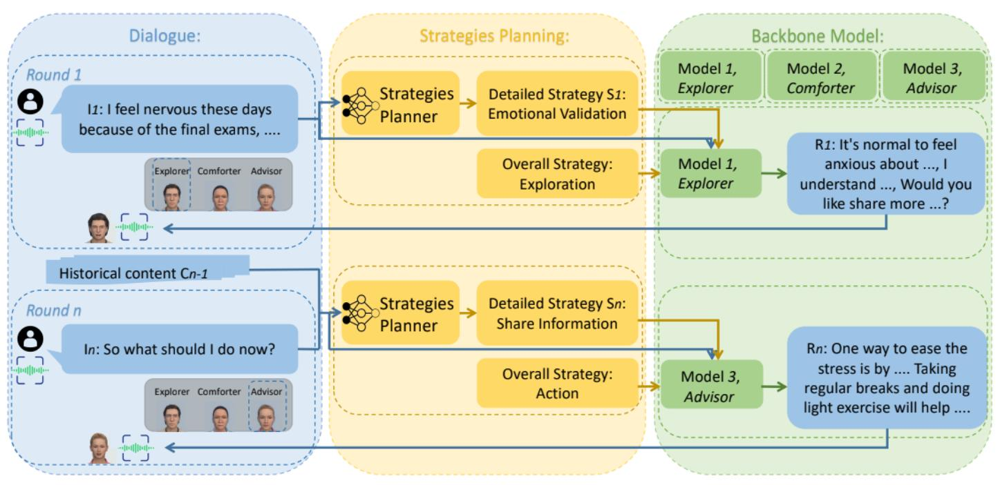

<!-- # Hey there, I'm Alexzhao (Sheng Zhao)!  -->

## Who I am

I'm **Sheng Zhao** (赵晟), and you can call me Alex. I'm a senior at [**Tsinghua University**](https://www.tsinghua.edu.cn/en/), Beijing, China 🏫. Now I am pursuing B.Sc. in **Fundamental Science** (Physics) and B.Eng. in **Electrical Engineering**🎓, at Weiyang College.

## Education

  

  
  

      <b><a href="https://www.tsinghua.edu.cn/en/">Tsinghua University</a></b>
        2021.9 - Present (2025.6 Expected)
        <b>B.Eng. in Electrical Engineering</b>
        <b>B.S. in Fundamental Sciences</b> (Physics)
      <!--   Research Assistant at HCI-Group, advised by Prof. <i>Xin Yi</i>
        Research Intern at C3ILab, advised by Prof. <i>Bowen Zhou</i> -->

  

## Research Experience

  
  

      <b><a href="https://pi.cs.tsinghua.edu.cn/">Tsinghua University HCI Group</a></b>
        2023.4 - 2024.6
        Advisor: Assistant Professor <a href="https://scholar.google.com/citations?hl=en&user=7Uy9RVYAAAAJ"><i>Xin Yi</i></a>.
        Work: 2 FA system [<a href="#Coordauth-section">P.1</a>]; Facial Expressions Scaling [<a href="#AvatarExpression-section">P.2</a>].
       
      <b><a href="https://c3i.ee.tsinghua.edu.cn/">Tsinghua University C3I Lab</a></b>
        2023.11 - 2024.6
        Advisor: Chair Professor; Shanghai AI Lab Manager <a href="https://scholar.google.com/citations?user=h3Nsz6YAAAAJ"><i>Bowen Zhou</i></a>.
        Work: 1Image2NovelViewSV3D [<a href="#1Image2NovelViewSV3D">R.1</a>].
  

  
  

      <b><a href="https://www.rochester.edu/">University of Rochester HCI Group</a></b>
        2024.1 - 2024.9
        Advisor: Assistant Professor <a href="https://scholar.google.com/citations?user=AXGtrecAAAAJ&hl=en&oi=ao"><i>Yukang Yan</i></a>.
        Work: VA for Mental Health [<a href="#VRCARES-section">P.3</a>].
  

  
  

      <b><a href="https://www.si.umich.edu/">Information Interaction Lab, University of Michigan</a></b>
        2024.6 - 2024.9
        Advisors: Associate Professor <a href="https://scholar.google.com/citations?user=W2XLsXoAAAAJ&hl=en&oi=ao"><i>Michael Nebeling</i></a> and Postdoc <a href="https://scholar.google.com/citations?user=YCJhuRMAAAAJ&hl=en&oi=sra"><i>Janet Johnson</i></a>.
        Work: DISCO [<a href="#DISCO-section">P.4</a>].
  

<!-- 
Previously, I was a research assistant at **Tsinghua University HCI Group**, under the advisory of Assistant Professor [<i>Xin Yi</i>](https://scholar.google.com/citations?hl=en&user=7Uy9RVYAAAAJ) and Professor [<i>Yuanchun Shi</i>](https://scholar.google.com/citations?user=TZm3-pwAAAAJ&hl=en&oi=ao). Meanwhile, I was a research intern under the supervisor of Chair Professor [<i>Bowen Zhou</i>](https://scholar.google.com/citations?user=h3Nsz6YAAAAJ) at **Tsinghua University**. And I also collaborated with Assistant Professor [<i>Yukang Yan</i>](https://scholar.google.com/citations?user=AXGtrecAAAAJ&hl=en&oi=ao) at **University of Rochester** remotely. Currently, I'm a research intern at **School of Information, University of Michigan**, under the supervisor of Associate Professor [<i>Michael Nebeling</i>](https://scholar.google.com/citations?user=W2XLsXoAAAAJ&hl=en&oi=ao) and Postdoc [<i>Janet Johnson</i>](https://scholar.google.com/citations?user=YCJhuRMAAAAJ&hl=en&oi=sra).I am also delighted to collaborate and discuss with my classmates [<i>Junrui Zhu</i>](https://zhujuneray.github.io/) and [<i>Jingwei Zuo</i>](https://dr-left.github.io/).
And at the same time, I'm a visiting student at [C3ILab](http://c3i.ee.tsinghua.edu.cn/), Tsinghua University, under the advisory of Prof. [Bowen Zhou](https://scholar.google.com/citations?user=h3Nsz6YAAAAJ&hl=en&oi=ao). -->

I am a human-centered technical researcher working at the intersection of <b>Human-Computer Interaction (HCI)</b>, <b>Machine Learning (ML)</b>, and <b>Artificial Intelligence (AI)</b>, where I apply human-centered methods to design, build, and study interactive systems and techniques, aiming to enhance their capacity to better serve human needs.

Specifically, my work follows three key threads:

- Percepting and modeling human behaviours in Mixed Reality (MR) to facilitate safe, trustworthy and immerse interaction technologies between human and MR devices and environments [[P.1](#Coordauth-section)], [[P.2](#AvatarExpression-section)].

- Exploring the design space of human-LLM interactions in MR to enhance LLMs' ability to better serve humans (e.g., improving collaboration efficiency, enhancing well-being) by considering factors such as team dynamics, human-AI alignment, and etc. [[P.3](#VRCARES-section)], [[P.4](#DISCO-section)].

- Enhancing the interactive capabilities of GAI (e.g. Diffusion Model) by adjusting based frameworks (e.g. Unet, Spatial and Temporal Attention Block), leading to customizable and controllable human utilization [[R.1](#1Image2NovelViewSV3D)].

<!-- 

  

 --> 

## Preprints

Note: To maintain <b>anonymity</b>, preprints under review are illustrated by their main topics rather than their titles.
<!-- I am striving to submit my work to <i>IMWUT (Ubicomp), UIST, CHI, MM</i> and <i>TVCG</i>.  -->

<!-- 

  
Click to view <b>publications & manuscripts</b>:
 -->

  <!-- 

    
 -->

  

  
  

      <b>[P.1] 2 Factor Authentication on HMDs</b>
        <b>Anonymous author(s)</b>, 1st Author.
       Preprint, VR'25 Submission (Rejected by IMWUT'24-a). 
       [<a href="https://drive.google.com/file/d/1nu8My7_aV61lu0zflA6P1AnhsmCXOA9R/view?usp=sharing">PDF</a>]
      [<a href="https://github.com/zhaosheng-thu/VRAuthentication">Code</a>]  

  

  
  

      <b>[P.2] Avatar Facial Expressions Scaling in VR</b>
        <b>Anonymous author(s)</b>, Co-1st Author.
       Preprint, CHI'25 Submission. 
       [<a href="https://drive.google.com/file/d/1NrWsxmTKIbign3oKdjtdKU37GUMXYGFP/view?usp=sharing">PDF</a>]
  

  
  

      <b>[P.3] Virtual Agents in VR for Mental Health</b>
        <b>Anonymous author(s)</b>, 1st Author.
       Preprint, CHI'25 Submission. 
       [<a href="https://drive.google.com/file/d/1Nqq3PtRd8rTnLe9EG6Ffr-bJcI8osO7G/view?usp=sharing">PDF</a>] [<a href="https://github.com/zhaosheng-thu/Llama3-8b-Emotion-Support">Code</a>]
  

  
  

      <b>[P.4] Designing Intelligent Spaces for Collaboration in MR</b>
       Preprint.
  

<!-- 

  
  

      <b>[1] <a href="https://zhaosheng-thu.github.io/publications/CoordAuth">CoordAuth: A Two-factor Authentication Method in Virtual Reality Leveraging Head-Eye Coordination</a></b>
        <b>Anonymous author(s)</b>, 1st Author.
       Preprint (Rejected by <i>IMWUT'24-a</i>). [<a href="https://zhaosheng-thu.github.io/publications/imwut24a.pdf">PDF</a>]
      [<a href="https://github.com/zhaosheng-thu/VRAuthentication">Code</a>]  

  

  
  

      <b>[2] <a href="https://zhaosheng-thu.github.io/publications/AvatarExpressions">Raise Your Eyebrows: Investigating the Impact of Virtual Avatar’s Facial Expression Scaling on Users’ Perception of Emotion and Uncanny Valley Effect in Social Virtual Reality</a></b>
        <b>Anonymous author(s)</b>, Co-1st Author.
       Preprint. [<a href="https://zhaosheng-thu.github.io/publications/chi25b.pdf">PDF</a>]
  

  
  

      <b>[3] <a href="https://zhaosheng-thu.github.io">Open Your Heart: Evaluating the Impact of Conversational Strategies and Multi-Agent Setting of LLM Assistants on User Emotional Support Experience in Virtual Reality</a></b>
        <b>Anonymous author(s)</b>, 1st Author.
       Preprint. [<a href="https://zhaosheng-thu.github.io/publications/chi25b.pdf">PDF</a>] [<a href="https://github.com/zhaosheng-thu/Llama3-8b-Emotion-Support">Code</a>]
  

  
  

      <b>[4] <a href="https://zhaosheng-thu.github.io">Disco: Dsigning Intelligent Spaces for Collaboration in Mixed Reality</a></b>
        <b>Anonymous author(s)</b>.
       Preprint.
  

 -->

## Repositories

  
  

      <b>[R.1] Singe Image Guided Novel View Image Synthesis by SV3D.</b>
       Facilitating more controllable and flexible novel view generation from a single image through precise camera parameters and enhanced attention blocks. Preparing for Submissions. 
       [<a href="https://github.com/zhaosheng-thu/NovelView-SVD-finetune">Code</a>]
  

## Hobbies

- 🎵 Favorite musicians: Stefanie Sun (孙燕姿) and Jay Chou (周杰伦).
- 📚 Favorite book: Dream of the Red Chamber (红楼梦).
- 🚴‍♂️ Passionate about outdoor activities and proud member of the **Tsinghua Cycling Team**. Strava account [here](https://www.strava.com/athletes/107292471). 
<!-- - :soccer: A soccer enthusiast, a dedicated supporter of Cristiano Ronaldo. -->

<!-- ## Others

I'll apply for HCI Ph.D. starting at Fall 2025.  -->