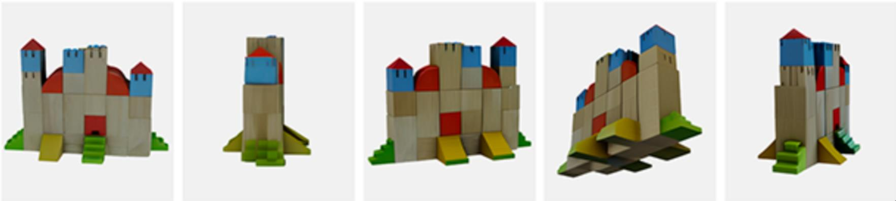
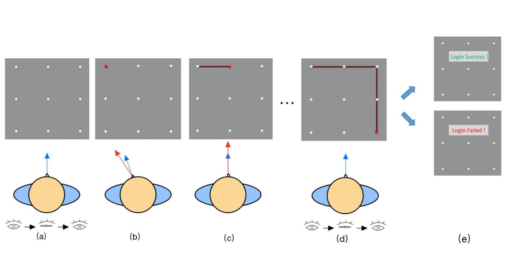
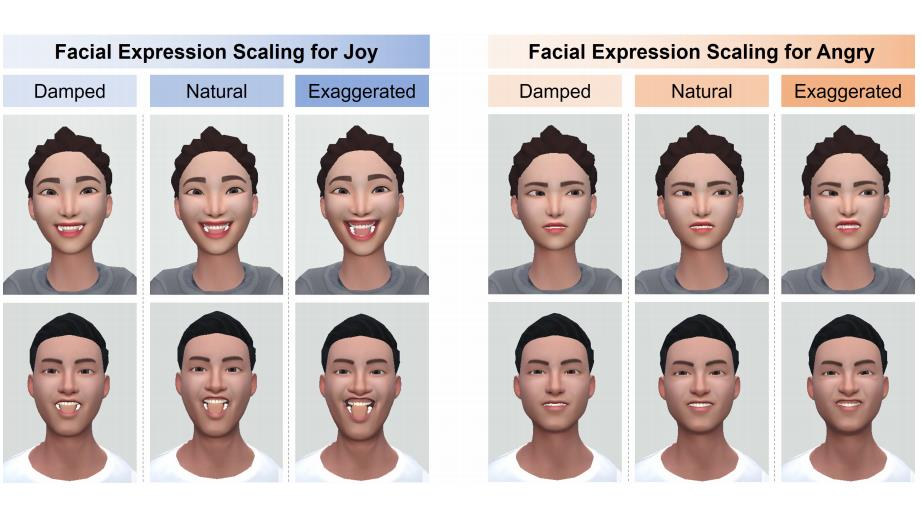
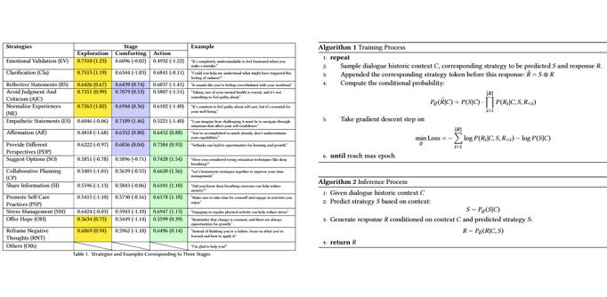

<!-- # Hey there, I'm Alexzhao (Sheng Zhao)!  -->

## Who I am

I'm **Sheng Zhao** (赵晟), an undergraduate student at Tsinghua University, Beijing, China 🏫. 
<!-- For more information, please refer to my [Curriculum Vitae](https://drive.google.com/file/d/1afqzCNoYhTbYer-mW-HA2aSQDCiQLajp/view?usp=sharing). -->

I will join the Department of Computer Science at University of Rochester, NY, USA as a Ph.D. student, working with Prof. [Yuhao Zhu](https://yuhaozhu.com/), from 25 Fall. 

My research focuses on AR/VR systems and visual computing, considering human perception modeling and neural rendering acceleration.
## Education

  

  
  

      <b><a href="https://www.tsinghua.edu.cn/en/">Tsinghua University</a></b>
        2021.9 - Present (2025.7 Expected)
        <b>B.Eng. in Electrical Engineering</b>
        <b>B.S. in Fundamental Sciences</b> (Mathematics and Physics)

  

## Experience

  
  

      <b><a href="">Zhipu AI</a></b>
        2025.3 - now
        Working on <a href="https://github.com/THUDM/CogAgent">CogAgent</a> and <a href="https://codegeex.cn/en-US">CodeGeeX</a>

  

  
  

      <b><a href="https://www.si.umich.edu/">Information Interaction Lab, University of Michigan</a></b>
        2024.6 - 2024.9
        Advisors: Professor <a href="https://scholar.google.com/citations?user=W2XLsXoAAAAJ&hl=en&oi=ao"><i>Michael Nebeling</i></a> and Postdoc <a href="https://scholar.google.com/citations?user=YCJhuRMAAAAJ&hl=en&oi=sra"><i>Janet Johnson</i></a>.
      <!--   Work: Exploring Collaborative GenAI Agents [<a href="#DISCO-section">P.4</a>]. -->
  

  
  

      <b><a href="https://www.rochester.edu/">Bear Lab, University of Rochester</a></b>
        2024.1 - 2024.9
        Advisor: Professor <a href="https://scholar.google.com/citations?user=AXGtrecAAAAJ&hl=en&oi=ao"><i>Yukang Yan</i></a>.
      <!--   Work: Virtual Agents for Emotional Support [<a href="#VRCARES-section">P.3</a>]. -->
  

  
  

      <b><a href="https://pi.cs.tsinghua.edu.cn/">PI Lab, Tsinghua University</a></b>
        2023.4 - 2024.6
        Advisor: Professor <a href="https://scholar.google.com/citations?hl=en&user=7Uy9RVYAAAAJ"><i>Xin Yi</i></a>.
      <!--   Work: HMD's 2 Factor Authentication System [<a href="#Coordauth-section">P.1</a>]; Facial Expressions Scaling [<a href="#AvatarExpression-section">P.2</a>]. -->
       
      <b><a href="https://c3i.ee.tsinghua.edu.cn/">C3I Lab, Tsinghua University</a></b>
        2023.11 - 2024.6
        Advisor: Professor; Shanghai AI Lab Manager <a href="https://scholar.google.com/citations?user=h3Nsz6YAAAAJ"><i>Bowen Zhou</i></a>.
      <!--   Work: 1Image2NovelViewSV3D [<a href="#1Image2NovelViewSV3D">R.1</a>]. -->
  

<!-- 
Previously, I was a research assistant at **Tsinghua University HCI Group**, under the advisory of Assistant Professor [<i>Xin Yi</i>](https://scholar.google.com/citations?hl=en&user=7Uy9RVYAAAAJ) and Professor [<i>Yuanchun Shi</i>](https://scholar.google.com/citations?user=TZm3-pwAAAAJ&hl=en&oi=ao). Meanwhile, I was a research intern under the supervisor of Chair Professor [<i>Bowen Zhou</i>](https://scholar.google.com/citations?user=h3Nsz6YAAAAJ) at **Tsinghua University**. And I also collaborated with Assistant Professor [<i>Yukang Yan</i>](https://scholar.google.com/citations?user=AXGtrecAAAAJ&hl=en&oi=ao) at **University of Rochester** remotely. Currently, I'm a research intern at **School of Information, University of Michigan**, under the supervisor of Associate Professor [<i>Michael Nebeling</i>](https://scholar.google.com/citations?user=W2XLsXoAAAAJ&hl=en&oi=ao) and Postdoc [<i>Janet Johnson</i>](https://scholar.google.com/citations?user=YCJhuRMAAAAJ&hl=en&oi=sra).I am also delighted to collaborate and discuss with my classmates [<i>Junrui Zhu</i>](https://zhujuneray.github.io/) and [<i>Jingwei Zuo</i>](https://dr-left.github.io/).
And at the same time, I'm a visiting student at [C3ILab](http://c3i.ee.tsinghua.edu.cn/), Tsinghua University, under the advisory of Prof. [Bowen Zhou](https://scholar.google.com/citations?user=h3Nsz6YAAAAJ&hl=en&oi=ao). -->

<!-- I am a human-centered technical researcher working at the intersection of <b>eXtended Reality (XR)</b> and <b>Generative Artificial Intelligence (GenAI)</b>. I focus on **understanding human behaviors** when interacting with digital objects, considering **visual representations**, **linguistic information**, and **interaction setups**. To this end, I implemented computational prototypes, conducted empirical studies, and deployed systems to advance our capabilities of perception, cognition, and interaction. Through my research, I aim to enhance human well-being in various ways, including improving emotional states [<a href="#VRCARES">3</a>], fostering collaboration [<a href="#DISCO">4</a>], enriching communication experiences [<a href="#FacialScaling">2</a>], sparking creativity [<a href="#1Image2NovelViewSV3D">5</a>], and advancing usable privacy and security [<a href="#CoordAuth">1</a>], all within digital interactive environments such as XR, with the help of GenAI. -->

## Peer-review Papers

  

    [1]. <strong>Sheng Zhao</strong>*, Junrui Zhu*, Shuning Zhang, Xueyang Wang, Hongyi Li, Fang Yi, Xin Yi, and Hewu Li. <em>CoordAuth: Hands-Free Two-Factor Authentication in Virtual Reality Leveraging Head-Eye Coordination.</em> 
    <u>Accepted as Conference Paper</u>, <em>The 32nd IEEE Conference on Virtual Reality and 3D User Interfaces (VR’25).</em> (* Equal Contribution) 
     [<a href="https://drive.google.com/file/d/1RFVvsPcA-gr3k55ahL-dNq2pXOacCl6i/view">PDF</a>][<a href="https://ieeevr.org/2025/program/papers/#16">ieeevr.org</a>][<a href="https://ieeexplore.ieee.org/abstract/document/10937423/">IEEE Xplore</a>]
  

  

    [2]. Xueyang Wang, <strong>Sheng Zhao</strong>, Yihe Wang, Ziyu Han, Xinge Liu, Xin Tong, and Xin Yi. <em>Raise Your Eyebrows Higher: Facilitating Emotional Communication in Social Virtual Reality Through Region-specific Facial Expression Scaling.</em> 
    <u>Accepted</u>, <em>2025 ACM CHI Conference on Human Factors in Computing Systems (CHI’25).</em> 
     [<a href="">PDF</a>][<a href="https://programs.sigchi.org/chi/2025/program/content/188476">sigchi.org</a>][<a href="https://dl.acm.org/doi/10.1145/3706598.3713688">ACM Library</a>]
  

  

    [3]. Janet Johnson, Macarena Peralta, Mansanjam Kaur, Sophia Huang, <strong>Sheng Zhao</strong>, Hannah Guan, Shwetha Rajaram, and Michael Nebeling. 
    <em>Exploring Collaborative GenAI Agents in Synchronous Group Settings: Eliciting Team Perceptions and Design Considerations for the Future of Work.</em> 
    <u>Accepted</u>, <em>The 28th ACM SIGCHI Conference on Computer-Supported Cooperative Work & Social Computing (CSCW’25).</em>
     [<a href="https://arxiv.org/abs/2504.14779">Arxiv</a>]
  

  

    [4]. <strong>Sheng Zhao</strong>, Janet Johnson, Xin Yi, and Yukang Yan. <em>Open Your Heart: Investigating the Impact of Dynamic Conversational Strategies and the Multiple Virtual Agent Setting on Emotional Support.</em> 
    <u>In submission</u>. <em></em>
  

## Service

**Reviewer**: IMWUT'24, OzCHI'25, VR'25, CHI'25, CHI LBW'25, ICWSM'25, DIS'25, ISMAR'25
 
**Student Volunteer**: CHI'25

## Repository

  
  

      <b>Singe Image Guided Novel View Image Synthesis by SV3D.</b>
       Facilitating more controllable and flexible novel view generation from a single image through precise camera parameters and enhanced attention blocks. 
       [<a href="https://github.com/zhaosheng-thu/NovelView-SVD-finetune">Github</a>]
  

<!-- 
## Misc

👉 **Question:** Why do I **focus on XR**? What kind of research do I want to conduct in XR?

Unfold

<blockquote>
From my understanding, <b>XR’s 3D digital representations</b> have revolutionized how humans interact with digital objects, enabling spatial and immersive multimodal experiences. However, current XR technologies face significant challenges, such as the bulky weight of head-mounted displays (HMDs), the lack of physical feedback when interacting with digital entities, and high rendering requirements. These limitations prevent XR from becoming a universal environment for computing and interaction.  

 
 This reminds me of the initial skepticism surrounding touch-based smartphones when they first emerged. However, with improvements in interaction methods like text entry and advancements in hardware capabilities, the iPhone achieved great success. <b>Could XR have similar potential?</b> As a human-centered researcher, I aim to identify how XR's 3D virtual interactions can provide the greatest benefits to people, particularly in which areas or downstream tasks, despite these existing limitations. The optimization of issues related to HMD rendering methods, imaging, and weight might have to be left to the experts in optics and hardware. 😈
</blockquote>

 

👉 **Question:** Why am I interested in **working on GenAI**?

Unfold

<blockquote>
(Well, I could say it's because it's trendy... 😅) Not becasue of trendy in fact, my true motivation lies in exploring the broader context of human interaction with the digital world. Specifically, <b>what GenAI has brought to humanity and how it might impact XR research</b> (whether positively or negatively). 
 
 In my view, XR offers richer visual representations and a wider range of interactive settings, such as opportunities for collaboration. GenAI, including large language models (LLMs) that provide rich linguistic information, diffusion models capable of generating high-resolution visual representations, and visual language models (VLMs) that align visual content with linguistic prompts, presents promising opportunities for advancing intelligent, multimodal interactive environments. However, overall, GenAI seems to offer greater benefits to 2D-based mobile phone interactions due to their portability and controllability. It seems harder for XR to benefit from GenAI.
 
 
Recently, Meta's Orion glasses provided a naive yet efficient answer: the context-aware ability of "Meta Look." This approach involves taking a photo with the camera, then transmitting the prompt and image to a small parameter VLM for processing. But this doesn't fully leverage the potential of AR (XR); after all, this can be easily done with a mobile phone, as seen with projects like WorldScribe (best paper @ UIST 2024), within most scenarios.
 
 
LLMR (honorable mention @ CHI 2024) seems to offer another solution, but it doesn’t appear to be fully direct: it’s not a true end-to-end generation process. Instead, it involves serializing visual representations into textual forms, and then using LLM agents (as tools) to infer executable code for scene compilation. I’ve been thinking—could there be a more efficient encoder for representing XR information (such as 3D assets, avatars, or data representations)? Then, we could use a diffusion model for controlled generation. This end-to-end approach would likely be more intuitive and efficient.

 
 
Moreover, with the emergence of various diffusion model variants (e.g., image 2 image, video generation, 3D reconstruction, editing, control), can XR environments benefit from diffusion models? Or could XR become a useful tool for advancing diffusion techniques? For example, visualizing the latent space of diffusion model for MLEs when they are coding / using diffusion to inference / training or debugging models.
 
 
Additionally, I believe that multimodal representations in XR have great potential in fields like A11Y, generative tools, and visualization tools, which would be excellent directions for XR research (XAIR, honorable mention @ CHI 2023).

</blockquote>

 

👉 **Question:** What **have I learned** from my past research on XR + GenAI?

Unfold

<blockquote>
Leveraging the powerful language capabilities of LLMs as the backend for multiple embodied agents in XR has the potential for various applications, such as in collaborative or individual settings <b>tailored to specific scenarios</b> (e.g., emotional support, collaboration dynamics). This is reflected in my work, including the manuscript for my CHI 2025 revision & resubmission, as well as my submissions to CSCW 2025 and CHI 2025 LBW.
 
 
However, despite the impressive capabilities of LLMs, their ability to enhance human well-being is <b>still limited</b>. LLM-supported avatars fall short compared to humans in recognizing and responding to human values. Additionally, due to the <b>uncanny valley effect</b>, mitigating the negative impacts of real-time embodied interactions requires significant effort (specific measures are discussed in my CHI 2025 paper, accepted with minor revisions). 
 
 
This calls for advancements in both the NLP and computer graphics fields. After all, HCI is an applied discipline that requires foundational theoretical research and practical development to truly shine. Perhaps I will also <b>attempt</b> to address (or at least mitigate) these significant challenges from a more theoretical and technical perspective.
</blockquote>

 

👉 **Question:** What do I **want to do in the future**?

Unfold

<blockquote>
This is a difficult question to answer. There are too many complex and obscure issues that need to be addressed. Over the past two years, I have worked on several projects (covering submissions to IMWUT, CHI, CSCW, VR, etc.), but when I reflect on them, I realize that they <b>struggle to fundamentally</b> solve the problems I mentioned earlier. At best, they offer some limited insights. In the future, I need more time to think and reflect on what exactly I need to do. It's a painful process, but it is also rewarding. ✨😊
 
 
Overall, I aim to <b>improve the usability of XR</b>, including <b>understanding human behavior and needs</b> when interacting with XR, enhancing the accessibility of XR systems to the physical world (through sensors, cameras,and fabrication), and from a GenAI perspective, exploring how XR can provide well-being to GenAI developers; how to leverage GenAI to enhance the diversity and practicality of XR applications, considering visual and textual representations, as well as interactive settings.
 
 
I am also open to exploring other research opportunities, such as using diffusion models for 3D reconstruction or building multimodal datasets for interactions between humans and the digital or physical world. Ultimately, I want to pursue research that <b>solves real-world problems</b> and makes tangible contributions to improving human life.
</blockquote>

 -->

<!-- Specifically, my work follows two key threads:

- Modeling and understanding human behaviours, building systems or proposing strategies for augmented experience [[P.1](#Coordauth-section)], [[P.2](#AvatarExpression-section)].

- Enhancing the interactive capabilities of GAI (e.g. Diffusion Model), leading to customizable and controllable human utilization [[R.1](#1Image2NovelViewSV3D)]. Specifically, integrating GAI in XR for human benefits (e.g. well-being, collaboration efficiency) [[P.3](#VRCARES-section)], [[P.4](#DISCO-section)]. -->

<!-- 

  
  

      <b>[1] <a href="https://zhaosheng-thu.github.io/publications/CoordAuth">CoordAuth: A Two-factor Authentication Method in Virtual Reality Leveraging Head-Eye Coordination</a></b>
        <b>Anonymous author(s)</b>, 1st Author.
       Preprint (Rejected by <i>IMWUT'24-a</i>). [<a href="https://zhaosheng-thu.github.io/publications/imwut24a.pdf">PDF</a>]
      [<a href="https://github.com/zhaosheng-thu/VRAuthentication">Code</a>]  

  

  
  

      <b>[2] <a href="https://zhaosheng-thu.github.io/publications/AvatarExpressions">Raise Your Eyebrows: Investigating the Impact of Virtual Avatar’s Facial Expression Scaling on Users’ Perception of Emotion and Uncanny Valley Effect in Social Virtual Reality</a></b>
        <b>Anonymous author(s)</b>, Co-1st Author.
       Preprint. [<a href="https://zhaosheng-thu.github.io/publications/chi25b.pdf">PDF</a>]
  

  
  

      <b>[3] <a href="https://zhaosheng-thu.github.io">Open Your Heart: Evaluating the Impact of Conversational Strategies and Multi-Agent Setting of LLM Assistants on User Emotional Support Experience in Virtual Reality</a></b>
        <b>Anonymous author(s)</b>, 1st Author.
       Preprint. [<a href="https://zhaosheng-thu.github.io/publications/chi25b.pdf">PDF</a>] [<a href="https://github.com/zhaosheng-thu/Llama3-8b-Emotion-Support">Code</a>]
  

  
  

      <b>[4] <a href="https://zhaosheng-thu.github.io">Disco: Dsigning Intelligent Spaces for Collaboration in Mixed Reality</a></b>
        <b>Anonymous author(s)</b>.
       Preprint.
  

 -->

## Hobbies

- 🎵 Favorite musicians: Stefanie Sun (孙燕姿) and Jay Chou (周杰伦).
- 📚 Favorite book: Dream of the Red Chamber (红楼梦).
- 🚴‍♂️ Passionate about outdoor activities and proud member of the **Tsinghua Cycling Team**. Strava account [here](https://www.strava.com/athletes/107292471). 

<!-- ## Others

I'll apply for HCI Ph.D. starting at Fall 2025.  -->