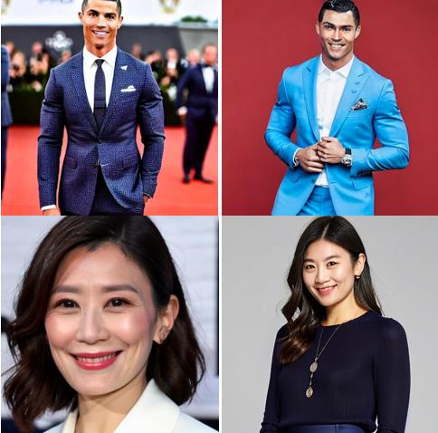
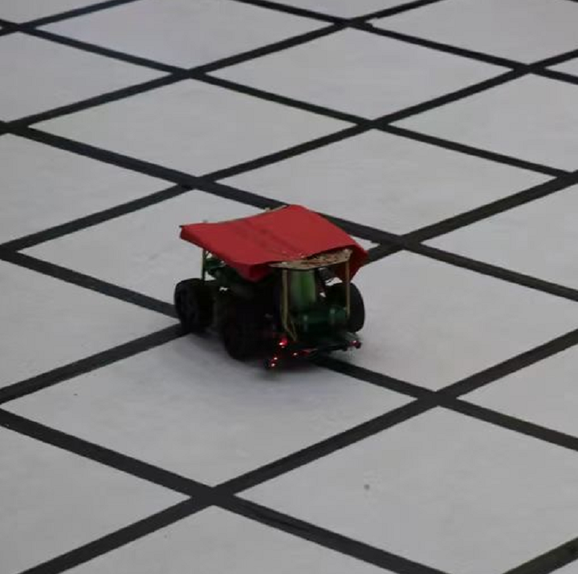
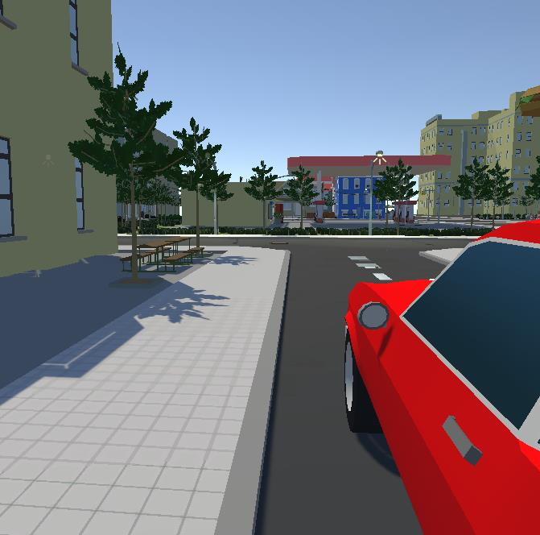
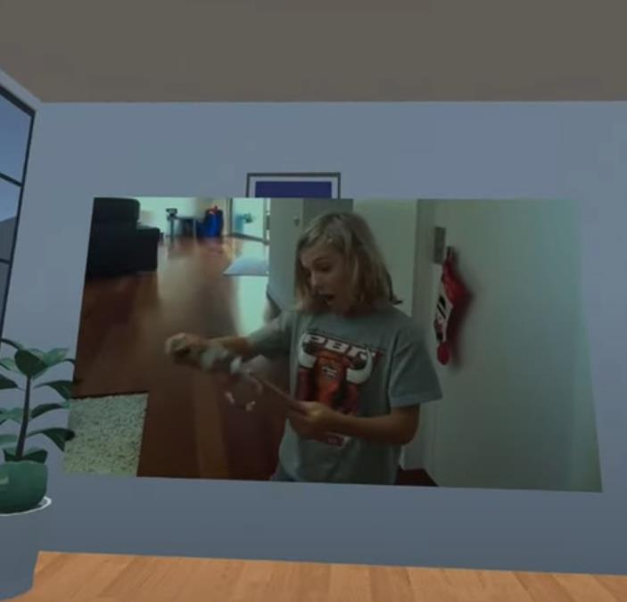



<!-- 
  
 -->

<header>
    <h1 style="font-size: 24px; font-style: italic;">Projects</h1>
    
</header>
<article>
  <!-- 

    <a id="HCI" href=".#HCI">
        <h2 style="font-size: 20px; font-weight: bold; font-family: Arial, sans-serif; color: rgba(0,0,0,0.1);">VR</h2>
    </a>
  
 -->
  

    

</article>

  
  

      <b><a href="https://zhaosheng-thu.github.io/projects/vrauth">CoordAuth</a></b>
        A Two-factor <b>Authentication</b> Method in Virtual Reality Leveraging Head-Eye Coordination.
        Keywords: <i>Human Computer interaction, Machine Learning, Virtual Reality, Usable privacy </i>
  

  
  

      <b><a href="https://zhaosheng-thu.github.io/projects/avatarfacialexpressions">EmoBlend</a></b>
        Revealing the Impact of Avatar's Facial <b>Blendshape</b> Intensity on Emotional Perception in VR.
        Keywords: <i>Human Computer interaction, Graphics, Virtual Reality, Social Computing </i>
  

  
  

      <b><a href="https://github.com/zhaosheng-thu/AvatarDiffusion">AvatarFusion</a></b>
        Utilizing dreambooth and LoRA to fine-tune <b>diffusion</b> model for avatar generation.
        Keywords: <i>Computer Vision and Pattern Recognition, Diffusion Model, Low-Rank Adaptation</i>
  

  
  

      <b><a href="https://zhaosheng-thu.github.io/projects/msp430car">SensVehicle</a></b>
        A self-navigating vehicle controlled by MSP430 and equipped with <b>sensors</b> and hardware.
        Keywords: <i>Sensors, Microcontroller, Greedy Algorithm </i>
  

  
  

      <b><a href="https://zhaosheng-thu.github.io/projects/drive">EVCDrive</a></b>
        A virtual driving environment in VR developed by Unity 3D.
        Keywords: <i>Virtual Reality </i>
  

  
  

      <b><a href="https://zhaosheng-thu.github.io/projects/cinema">VRCinema</a></b>
        Enjoying a unique sense of immersion while watching movies.
        Keywords: <i>Virtual Reality </i>
  

