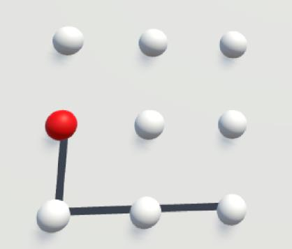

# VisionSpin: A Two-Factor Authentication in VR

    

**[The repository](https://github.com/zhaosheng-thu/VRAuthentication)** has implemented a two-factor authentication method in VR. One factor is the 3*3 pattern, serving as a knowledge-based layer. The second factor involves the features of head and eye position, as well as velocity segments during eye saccades and fixations, constituting a behavioral biometric authentication layer.

## Scenes:

1. **3*3 Unlock UI**: I have designed unlock screens of various sizes, allowing you to draw your pattern using your gaze, similar to unlocking a phone. Not sure how to begin? Close your eyes for 0.5 seconds and then open them; you'll notice a cursor appearing! Now, start drawing your pattern to unlock!

2. **Calibration UI**: Designed a calibration scene similar to Quest Pro. You can save the position of your visual cursor and the actual calibration point to a file. This can help you get a rough understanding of the tracking latency and accuracy.

## Models:

- We used SVM, KNN, RF, MLP, and Resnet, incorporating a 1/3 Gaussian noise level for data augmentation. Additionally, utilizing k-fold cross-validation, the achieved accuracy is greater than 98%, and both the false rejection rate (FRR) and false acceptance rate (FAR) are maintained below 0.05. Our system demonstrated robust resilience to external attacks, thanks to the robustness conferred by the behavioral biometric features. 

- Data preprocessing, data augmentation, Fisher score computation, and model training code can be found [here](https://github.com/ZhuJunray/srt_vr_auth)