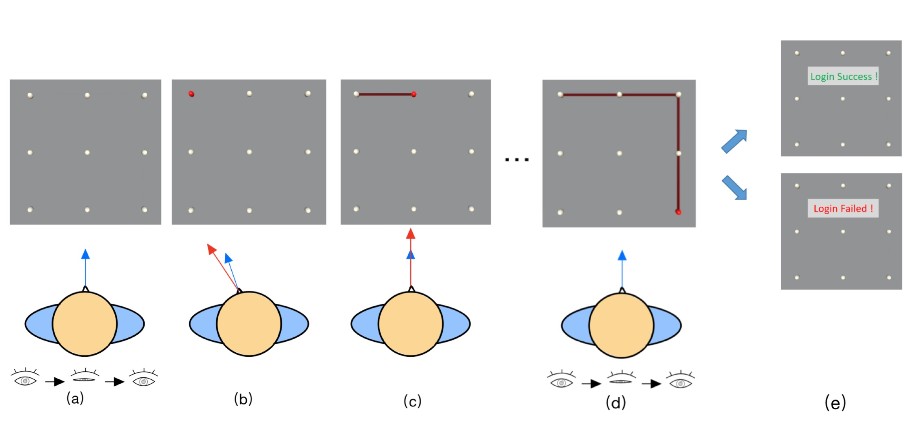
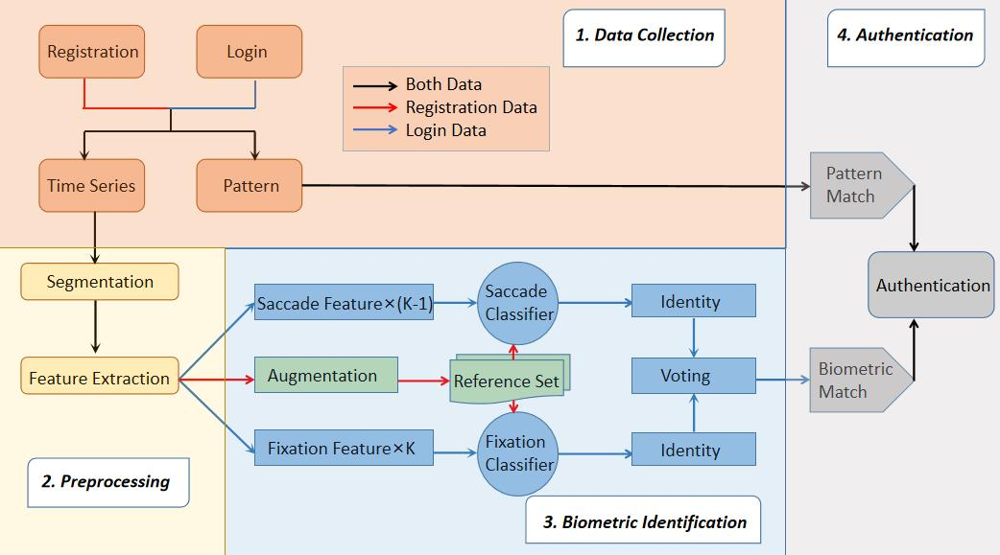

    

**[The repository](https://github.com/zhaosheng-thu/VRAuthentication)** has implemented CoordAuth's UI layout in VR by Unity. Additionally, **[The repository](https://github.com/ZhuJunray/srt_vr_auth)** has implemented the Algorithm Design and Implementation of CoordAuth.

    

- **3*3 Unlock UI**: I have designed unlock screens of various sizes, allowing you to draw your pattern using your gaze, similar to unlocking a phone. Not sure how to begin? Close your eyes for 0.3 seconds and then open them, you'll notice a cursor appearing! Now, start drawing your pattern to unlock!

- **Algorithm Design and Implementation**: Leveraging unique head-eye coordination features, CoordAuth combined pattern-based classifiers and majority voting-based behavioral biometric classifiers for two-factor authentication, achieving 0.04% False Acceptance Rate (FAR) and 0.88% False Rejection Rate (FRR) during leave-one-out simulation.

- **Usability**: CoordAuth also exhibited longitudinal stability with a 0.32% FAR and 2.73% FRR across 7 days. The subsequent usability and shoulder-surfing attack study proved CoordAuth's usability and robustness, where CoordAuth achieved 3.82s authentication time, 2.50% Error Rate, and 0.60% Attack Success Rate (ASR) comparable to knowledge-based and behavioral-biometric-based baselines.

If you find this interesting, feel free to read our **[paper](/publications/imwut24a-sub3876.pdf)**!