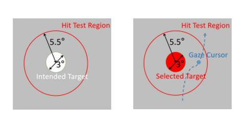

I have designed a two-factor authentication system called **CoordAuth**, which combines a knowledge-based factor with a behavioral biometric factor.

    

- Novel **Interaction** Method: Head-mounted displays, represented by Apple Vision Pro, are beginning to adopt eye-tracking interaction. Therefore, CoordAuth discards the controller, opting instead to utilize gaze interaction for authenticating. Initially, a non-spontaneous blink triggers the start of the input procedure. Users then utilize their gaze cursor to go across the hit test region of the intended object. Finally, another non-spontaneous blink triggers the end. CoordAuth evaluates the success or failure of the login by considering both the entered pattern and the behavioral biometrics associated with head-eye coordination movements. The UI layout of CoordAuth has been implemented in VR using Unity, and the details can be found in [This repository](https://github.com/zhaosheng-thu/VRAuthentication).

    To determine the optimal field of view (FOV) size for CoordAuth, I conducted a user study where various sizes of unlock UI were designed and evaluated. The study measured input error rates, input time, and subjective ratings for different FOV settings.

    

- **Algorithm** Design and Implementation: To best leverage unique head-eye coordination features, CoordAuth firstly collects data from the IMU sensor and the eye trakcers. Then, it utilizes the human factors during the continuous saccades, spilts the raw time series to saccade segments and fixation segments. Then CoordAuth conducts feature extraction, utilizes the saccade features to train saccade classifiers, utilizes the fixation features to train fixation classifiers. Finally CoordAuth uses the majority voting mechanisum to combined this two types of behavioral biometric classifiers for authentication. CoordAuth achieved 0.04% False Acceptance Rate (FAR) and 0.88% False Rejection Rate (FRR) during leave-one-out simulation.  I'm honored to have contributed equally with [Juneray Zhu](https://zhujuneray.github.io/) to [this repository](https://github.com/ZhuJunray/srt_vr_auth)👋, which implemented the Algorithm Design and Implementation of CoordAuth. I am sincerely delighted to collaborate with June!

    

- **Usability**: CoordAuth also exhibited longitudinal stability with a 0.32% FAR and 2.73% FRR across 7 days. The subsequent usability and shoulder-surfing attack study proved CoordAuth's usability and robustness, where CoordAuth achieved 3.82s authentication time, 2.50% Error Rate, and 0.60% Attack Success Rate (ASR) comparable to knowledge-based and behavioral-biometric-based baselines.

If you find this interesting, feel free to read our **[paper](/publications/imwut24a-sub3876.pdf)**! 