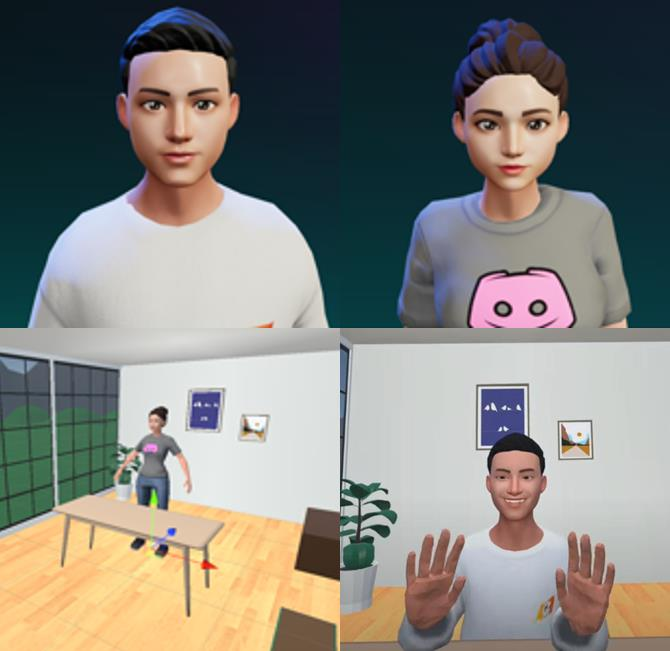
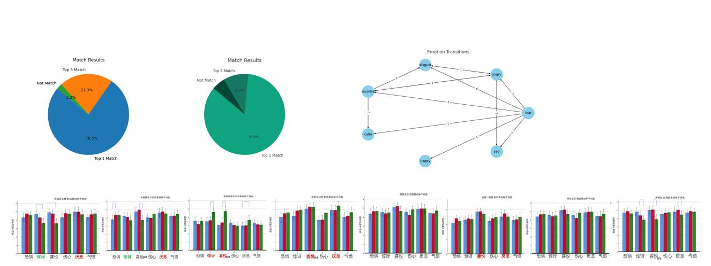

    

We investigated the impact of facial blendshape intensity on users' emotional perception experience and and the uncanny valley effect through semi-structured **interviews** and 7Likert-scale **questionnaires**, according to six types of emotions.

    

Furthermore, we proposed a specific implementation method to alleviate the **uncanny valley** effect and enhance the efficiency of emotional perception for users, allowing both conversational parties to have a better experience.

As the experiment's platform, [this repository](https://github.com/zhaosheng-thu/AvatarFacial) has implemented face2face chat in VR, utilizing the official SDK for [Oculus Movements](https://github.com/oculus-samples/Unity-Movement).
- **Face2Face Chat**: Through TCP socket programming, I have developed a scene that allows two virtual avatars to engage in face-to-face communication within a virtual environment. Both users can see each other's body movements and facial expressions in real time, providing a new form of social interaction.

- **Skeletal-driven avatar**: During the chat, users can enable a recording feature, allowing Unity to record the users' skeletal motion states and audio. This recorded data can be utilized after the chat session ends to drive a new virtual avatar to replicate the previously recorded actions and speech. This enhances the playability and interactivity for users. 

<!-- - **Virtual Cinema**: Created a virtual cinema within the VR world, providing users with a cinematic experience.  -->

<!-- If you find this interesting, feel free to watch [Demo1](https://www.youtube.com/watch?v=puNORFzl48w) and [Demo2](https://www.youtube.com/watch?v=2zthpene_yg)! -->

    <iframe width="200" height="120" src="https://www.youtube.com/embed/puNORFzl48w" allowfullscreen></iframe>

